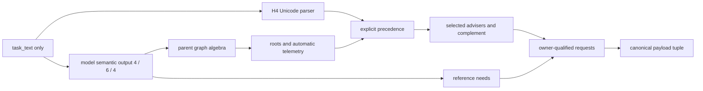

# AQ8 fresh-corpus contract

Status: **STRUCTURALLY COMPLETE CONTRACT**. This directory contains only the
closed corpus schema. It contains no authoring cases, heldout cases, model
calls, evaluator results, or replay material. The companion synthetic tests
validate the schema and all frozen Git-object bindings, including the separately
committed AQ8 gate authority.

The maximum claim is structural only: the schema and synthetic resolver tests
show that a prospective corpus *can be checked* against the frozen H4 algebra.
They do not establish model, provider, runtime, sandbox, product, efficacy,
promotion, authority, effect, or external-action behavior.

## Closed document shape

Both splits use
[`activation-schema.json`](./activation-schema.json), a closed JSON Schema
Draft 2020-12 document. The root identifiers and non-secret custody nonces are
exact:

| Split | `corpus_id` | `split_nonce` |
|---|---|---|
| Authoring | `AQ8-authoring` | `fcedacb4116091fe69d412a085fd40e350b8f1c7e70348dd3dd950d1752da1c2` |
| Heldout | `AQ8-heldout` | `20651a71f2e6739a41089b5fc0ea3474120f2e9e97f8f0f6274d926abc5b2671` |

Each split has exactly 36 cases, in ordinal order. Case IDs are exactly
`<corpus_id>-01` through `<corpus_id>-36`. A case nonce is not authorable
entropy; the validator requires
`SHA256(split_nonce + "|" + case_id)`.

The future documents must be authored fresh only after all bound authorities,
including the AQ8 gate, are immutable. Authoring and heldout custody must be
independent, and the heldout text must remain blinded from mechanism and
evaluator implementation. The validator can prove closed bytes, exact
derivations, uniqueness, and cross-split non-overlap; it cannot by itself prove
human independence or blinding. Prior corpus text, outcomes, evaluator output,
and replay material are prohibited inputs.

Each case has exactly six fields:

1. `case_id`
2. `case_nonce`
3. `task_text`
4. `task_text_nfc_sha256`
5. `expected_semantic_output`
6. `expected_parent_derivation`

`task_text` must already be Unicode Normalization Form C (NFC), and its digest
is SHA-256 over the NFC UTF-8 bytes. Within a split, task text, prompt digest,
and case nonce must be unique. Across the paired splits, prompt digests and
case nonces must be disjoint.

## Ownership and model boundary

Only this projection is supplied from a corpus case to the model:

```json
{"task_text": "<case task_text>"}
```

The frozen H4 condition adapter supplies its own identical instruction, slot
order, pair order, support legend, and condition-specific anonymous guidance.
No case label or parent-derived field is projected. In particular, adviser
names, explicit-token mappings, routes, roots, selections, reference owners,
payloads, claims, and results remain evaluator-side.

`expected_semantic_output` is the only model-corresponding label surface and is
owned by the evaluator. It has exactly the frozen H4 arrays:

- four `candidate_states` in `s0, s1, s2, s3` order;
- six `pairwise_relations` in `(s0,s1), (s0,s2), (s0,s3), (s1,s2),
  (s1,s3), (s2,s3)` order; and
- four `reference_needs` in `s0, s1, s2, s3` order.

Everything in `expected_parent_derivation` is a redundant equality oracle, not
an independent label. The executable validator recomputes the entire object
from `task_text`, `expected_semantic_output`, and frozen authority constants.



## Mechanical parent derivation

The validator applies the H4 precedence exactly:

1. Reject a semantic-schema failure before parsing task text.
2. Check relation/state compatibility. A mismatch is `graph_invalid`.
3. Construct controller-to-downstream edges and reject cycles as
   `graph_cycle`.
4. Require explicit transitive closure. Missing or contradictory closure is
   `graph_invalid`.
5. After those checks, any uncertain state or relation is
   `graph_uncertain`.
6. Otherwise roots are unresolved slots with indegree zero. Zero through two
   roots are selected automatically in slot order; more than two roots retain
   telemetry but yield `cap_exceeded` and an empty automatic selection.

The explicit parser normalizes with NFC, then scans a maximal invocation-like
body: `$`, one ASCII letter, and zero or more ASCII letters, digits, or `-`.
The codepoints immediately before `$` and after the maximal body may be absent.
When present, either boundary is rejected for Unicode category prefixes `L`,
`N`, or `M`, exact categories `Cf` or `Pc`, or literal `_` or `-`. There is no
trimming, case folding, substring expansion, or token rewriting.

After graph telemetry is computed, explicit precedence is:

1. any bounded unrecognized invocation-like token: `unrecognized`;
2. exactly one qualified occurrence: `exact`;
3. more than one qualified occurrence: `ambiguous`;
4. no invocation-like token: preserve automatic selection.

An exact token selects its one mapped slot without rewriting graph telemetry.
The corpus distribution permits exactly four explicit cases, one for each
qualified token. The other 32 task texts must parse no invocation-like token
and must contain no canonical adviser name.

Selected slots map in stable order to these advisers and exact qualified
tokens:

| Slot | Adviser | Qualified token | Primary trigger | Secondary trigger |
|---|---|---|---|---|
| `s0` | `agentic-engineering` | `$agentic-engineering` | `decomposition-boundary` | `architecture-boundary` |
| `s1` | `codex-task-contract` | `$codex-task-contract` | `decision-contract` | `reference-isolation` |
| `s2` | `verification-strategy-engineering` | `$verification-strategy-engineering` | `verification-evidence` | `reference-isolation` |
| `s3` | `engineering-learning-loop` | `$engineering-learning-loop` | `reference-isolation` | `learning-adoption` |

The complement is every unselected adviser in the same frozen slot order.
Unselected slots must have reference need `none`. A selected `primary` or
`secondary` need emits exactly one owner-qualified request; `uncertain` records
the selected slot but emits no request; `none` emits no request. Requests never
influence graph or routing.

The canonical cover matches both request owner and trigger, minimizes payload
count, then chooses the lexicographically smallest payload-ID tuple. Output IDs
are ascending and the cap is three. The chosen tuple, status, and count are
recomputed and equality-checked; they are not freely authorable.

## Validator-owned balanced distribution

The case ordinal owns its profile. A profile tag is intentionally absent from
the JSON because the validator derives it from the semantic graph and task
text.

| Ordinals | Derived profile | Count | Required exercise |
|---|---:|---:|---|
| 01-02 | no unresolved / native automatic | 2 | zero roots, empty selection |
| 03-06 | single root | 4 | each slot is the sole root once |
| 07-12 | independent pair | 6 | every canonical pair once, two roots |
| 13-18 | controller/downstream pair | 6 | every pair once, 3 left/3 right directions |
| 19-22 | transitively closed three-node chain | 4 | each root and omitted slot once |
| 23-26 | three-node fork | 4 | each root and omitted slot once |
| 27-28 | four-node diamond | 2 | opposite `s0`/`s3` orientations, explicit closure |
| 29-30 | uncertainty abstention | 2 | one uncertain state, one uncertain relation |
| 31-32 | cap abstention | 2 | exactly three and four independent roots |
| 33-36 | exact explicit | 4 | one qualified token mapped to each slot |

This yields exactly 32 automatic-text cases and four exact-token cases per
split. Automatic root selections contain each slot eight times; explicit
selection adds each slot once, for nine total selections per slot. Selection
statuses are exactly 28 `automatic`, two `graph_uncertain`, two `cap_exceeded`,
and four `exact`.

Reference needs are also fixed mechanically. Across the 144 slot rows per
split the exact counts are 112 `none`, 14 `primary`, 14 `secondary`, and four
`uncertain`. Among each slot's nine selections:

| Slot | Primary | Secondary | Uncertain | None |
|---|---:|---:|---:|---:|
| `s0` | 4 | 3 | 1 | 1 |
| `s1` | 3 | 4 | 1 | 1 |
| `s2` | 4 | 3 | 1 | 1 |
| `s3` | 3 | 4 | 1 | 1 |

The validator additionally requires coverage of all eight owner/primary-or-
secondary request identities and checks every canonical payload tuple.

## Frozen custody

The schema binds the H4 authority commit
`d6f9e6089e6e11f158a2d3bf4af717fc026548d4`, tree
`6b65ea1e125836c9ae684e869f1156e5750c7a0b`, and the exact path/raw-SHA-256
rows for the authority manifest, protocol, semantic schema, runtime schema,
condition adapter, and reference policy. It also binds:

- active H4 parser projection SHA-256
  `8920ab58abd9618fb1af4894e1b664d76d3c6f478d335e1d61e08ac47b9360d1`;
- AQ8 gate authority commit `953651815e76c56f0cf8d23d9eae9ef6a480726f`,
  tree `83c5aa7ecd3930733071e509ba56d307ae49aa59`, path
  `evals/foundation-v4/unresolved-decision-graph-gates-v8.json`, SHA-256
  `d17c6de19b456100a0c930d9cbe898d123dab882fe924c92226f9962fc7784d8`;
- base candidate commit `f09a0544acf4b7a95fff796434273511a0683ca9`, tree
  `38c8c8adf3bb633d33200df1ec65f33e985ae244`, path
  `evals/foundation-v4/reduced-four-skills/candidate.json`, SHA-256
  `854f67bdd03e7121bd20e5513ef61ac806d016b3a5f1d6e5891bf4d9e546eb1f`;
  and
- recorded plan commit `b304aa09a8228b8c96e50a7c678a45baf84a7a49`, tree
  `adbf28fdd11120f5a567e2be56eb90da21c4eafe`.

The companion test does not trust a copied local mapping. It uses `git show` at
the bound commits to parse the frozen H4 protocol, H4 reference policy, and base
candidate; derives slots, pairs, enums, tokens, adviser/trigger rows, payload
IDs, payload SHA-256 values, and cover policy from those objects; and compares
the local schema and algorithms to those projections. It also canonicalizes
`explicit_constraint.h4_parent_parser_contract` and requires its SHA-256 to
equal the schema's active parser projection binding.

## Exact boundary and checks

Every corpus document repeats the following closed boundary and the schema
requires exact equality:

```text
observation_state = no-results
replay_policy     = no-replay
tuning_policy     = no-tuning
failure_policy    = terminal-AQ8
claim_ceiling     = structural-only
all runtime/provider/model/sandbox/product/efficacy/promotion/
authority/effect/external-action flags = false
```

Run only the synthetic contract suite before authoring:

```bash
python3 -m unittest discover -s tests -p 'test_future_activation_contract_v8.py' -v
```

The retained red mutations cover transitive closure, tuple order, root equality,
pair/state coherence, Unicode token boundaries and explicit precedence,
distribution drift after downstream recomputation, unselected reference needs,
canonical payload tuples, authority/claim mutation, NFC/digest mismatch, and
cross-split prompt coupling. Passing these tests is structural evidence only.
No model call, canary, batch, replay, or result inspection is authorized by this
contract.
